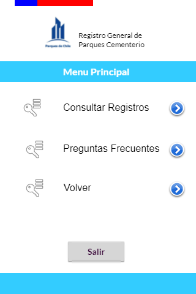
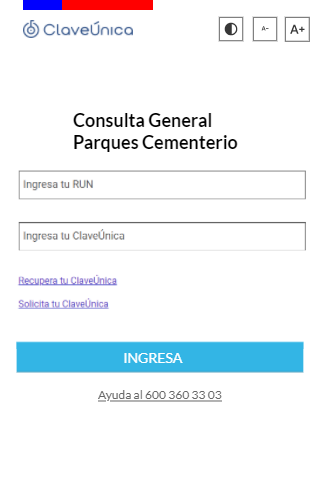
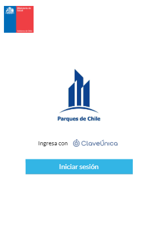
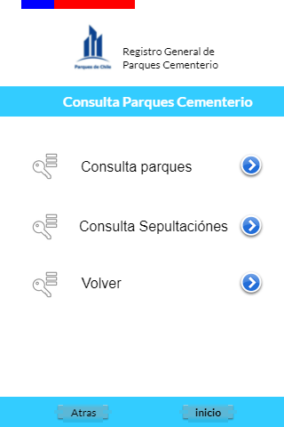
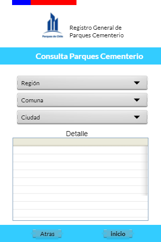
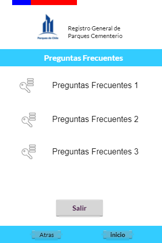

# TrabajoU3_IONIC
Parques de Chile - Prototipo de Baja Fidelidad - IONIC
* [DESCRIPCION]
    * Este trabajo consiste en mostrar el uso básico del framework IONIC para el desarrollo de un prototipo funcional de baja calidad del proyecto realizado en
      la Asignatura **TALLER DE DISPOSITIVOS MOVILES - 250 - 453687**.
    * El objetivo principal es comprender la forma de construir una aplicación móvil, utilizando un framework de desarrollo.

* [PLATAFORMA DE PRUEBA]

  El prototipo fué desarrollado bajo la siguiente plataforma de trabajo: 
    *   Sistema Operativo: Windows 10 Pro
         Versión: 22H2
         Compilación del sistema operativo: 19045.3570
         Tipo de sistema: Sistema operativo de 64 bits, procesador basado en x64
    *   Procesador: Intel(R) Core(TM) i5-6200U CPU @ 2.30 GHz 2.40GHz
    *   RAM Instalada: 16.0 GB (15.9 GB usable)
    *   Node Version: v21.1.0
    *   IONIC Version: 7.1.1
  
* [CONSIDERACIONES GENERALES]
    *   La única funcionalidad que presenta este prototipo, es poder navegar entre las diferentes páginas de la app.
    *   La página "splash" no tiene boton de interacción, sólo pretende ser la interfaz inicial de carga de la aplicación.
    *   La primera página con interacción es la página "clave única" que es donde el usuario ingresa a la aplicación.
    *   La aplicación NO contiene código alguno de validación de autentificación. Sólo consiste en mostrar la navegación aplicada a las diferentes interfaces.
    *   La estructura del código del proyecto consiste en 8 páginas que corresponden a las interfaces de la aplicación, las cuales son:
      
    Página 1: Splash   Página 2: Home   
    
    Página 3: Clave Unica   Página 4: Login   
    
    Página 5: Consultas   Página 6: Parques   
    
    Página 7: Sepultaciones   Página 8: FAQ   
    
    *   La estructura del código del proyecto consiste en 8 páginas que corresponden a las interfaces de la aplicación, las cuales son:
      
